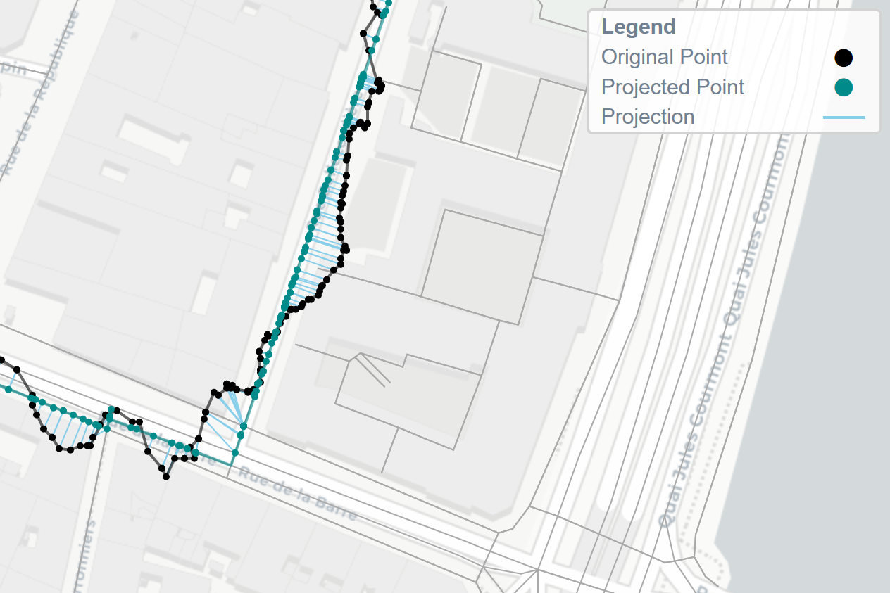

# noiseplanet

[](http://noiseplanet.readthedocs.io/en/latest/index.html)
[](http://http://noise-planet.org/)

**Python for map matching and mapping geojson tracks**


This library is a project within the research center *UMR-AE/CNRS*, working on NoisePlanet for noise mapping.
Made in collaboration with the *École Nationale des Sciences Géographiques*.

**Citation :** Dujardin, A., Mermet, S. (2020). État de l’art et suggestions pour la cartographie des données acoustiques mobiles. *Projet de recherche*.

## Overview

**noiseplanet** is a Python package that lets you extract, correct, and plot geojson data on Leaflet maps.
The main focus of this package is on map matching, and uses Open Street Map network as reference.
The geojson track should contains a list of GPS points that you want to match on the street graph. The only informations used for the map matching are the points coordinates.


## Installing
### Dependencies
This module use several packages :
- **numpy**,
- **pandas**,
- **json**,
- **osmnx**,
- **leuvenmapmatching**, *KU Leuven - DTAI Research Group, Sirris - Elucidata Group*.

To install, use :
```
pip install noiseplanet
```
If this doesn't work, clone the repository, and in the *noiseplanet* folder, use :
```
pip install .
```

### Optional dependencies

For plotting and interface, the following packages are used :
- **matplotlib**,
- **folium**,
- **sqlite3**.

Note that these packages are optional if you don't want to visualize the resulting maps. *SQLite3* is used to stock all the informations of a geojson tracks or polygon into an SQL database.


### Development

If you want to participate to the improvement of this project, clone the repository and open it as a project. We used *spyder* to create the packages and modules.

### Structure

*noiseplanet* is composed by internal sub-packages:
- **matching** lets you correct tracks and match it to the *Open Street Map* network,
- **utils** mainly handles conversion from geojson, metadata etc. to *DataFrame*,
- **ui** is used to generate *Leaflet* maps,
- **io** handles reading and writing files,
- **db** lets you access a *SQLite3* database.

## Usage

This project was created to provide new ways of mapping for the *UMR-AE/CNRS* team. 

### Map Matching

The **noiseplanet** package provides different tools for matching a track to the *Open Street Map* network.
- matching to the **nearest** edge,
- **hmm** based matching.
To match a track, composed by latitudes and longitudes, use :
```python
import numpy as np
import osmnx as ox
from noiseplanet import matching

track = np.array([[45.7584882 ,  4.83585996],
                  [45.75848068,  4.83586747],
                  [45.75849549,  4.83585205],
                  [45.75849134,  4.83584647],
                  [45.75848135,  4.8358245 ],
                  # ...
                  [45.75846756,  4.83580848],
                  [45.75844998,  4.83580936],
                  [45.7584067 ,  4.83580086],
                  [45.7584067 ,  4.83580086],
                  [45.75839346,  4.83579883]])

graph = matching.model.graph_from_track(track)

track_coor, route_corr, edgeid, stats = matching.match(graph, track, method='hmm')
```

And visualize the results :

```python
from noiseplanet.ui import plot_html

# Plot the graph
plot_html(track, track_corr=track_corr, route_corr=route_corr,
          proj=True, show_graph=True)
```


You can change the matching method.
For example, the above method uses **Hidden Markov Models**, and is the best way to match a track on the OSM (see the report for more details).
However, you can use a naive method to match the track on the nearest road :


```python
track_coor, route_corr, edgeid, stats = matching.match(graph, track, method='nearest')
```

And visualize the results :

```python
from noiseplanet.ui import plot_html

# Plot the graph
plot_html(track, track_corr=track_corr, route_corr=route_corr,
          proj=True, show_graph=True)
```


Check the read the docs documentation for more depth in the functions used.
You can also see the report publied for this project : Dujardin, A., Mermet, S. (2020). État de l’art et suggestions pour la cartographie des données acoustiques mobiles. *Projet de recherche*.


## Authors

- **Arthur Dujardin**
- **Samuel Mermet**


